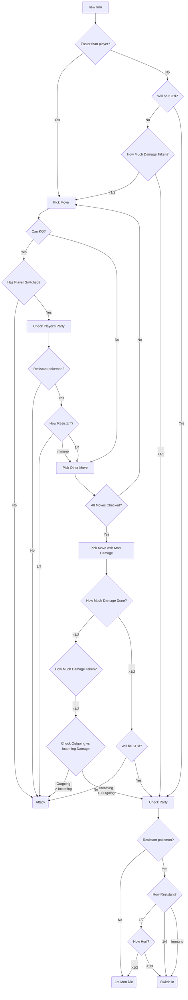

# Trainer AI Decision Tree

```mermaid
flowchart TD;
    newTurn --> amFaster{Faster than player?};
    amFaster -- Yes --> pickMove[Pick Move];
    amFaster -- No --> willDie{Will be KO'd?};
    pickMove --> canKO{Can KO?};
    canKO -- Yes --> hasPlayerSwitch{Has Player Switched?};
    hasPlayerSwitch -- No --> attack(Attack);
    hasPlayerSwitch -- Yes --> checkPlayerParty[Check Player's Party];
    checkPlayerParty --> resistanceFound{Resistant pokemon?};
    resistanceFound -- No --> attack;
    resistanceFound -- Yes --> howResistant{How Resistant?};
    howResistant -- 1/2 --> attack;
    howResistant -- Immune --> pickOtherMove(Choose Different Move);
    howResistant -- 1/4 --> pickOtherMove;
    canKO -- No --> pickOtherMove[Pick Other Move];
    pickOtherMove --> allMovesChecked{All Moves Checked?};
    allMovesChecked -- No --> pickMove;
    allMovesChecked -- Yes --> mostDamage[Pick Move with Most Damage];
    willDie -- No --> howHurt2{How Much Damage Taken?};
    willDie -- Yes --> checkParty[Check Party];
    checkParty --> checkForResistance{Resistant pokemon?};
    checkForResistance -- No --> letDie(Let Mon Die);
    checkForResistance -- Yes --> howResistant2{How Resistant?};
    howResistant2 -- 1/2 --> howHurt{How Hurt?};
    howResistant2 -- 1/4 --> switchIn;
    howResistant2 -- Immune --> switchIn(Switch In);
    howHurt -- "<br>&gt1/3" --> letDie;
    howHurt -- "<1/3" --> switchIn;
    howHurt2 -- "<1/2" --> pickMove;
    howHurt2 -- "<br>&gt1/2" --> checkParty;
    mostDamage --> howMuchDamage{How Much Damage Done?};
    howMuchDamage -- "<1/2" --> damageDone{How Much Damage Taken?};
    howMuchDamage -- "<br>&gt1/2" --> willDie2{Will be KO'd?};
    willDie2 -- No --> attack;
    willDie2 -- Yes --> checkParty;
    damageDone -- "<br>&lt1/2" --> checkVSPlayer{Check Outgoing vs Incoming Damage};
    checkVSPlayer -- "Outgoing <br>&gt Incoming" --> attack;
    checkVSPlayer -- "Incoming <br>&gt Outgoing" --> checkParty;
    
```